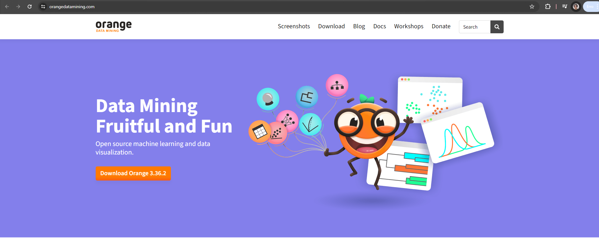
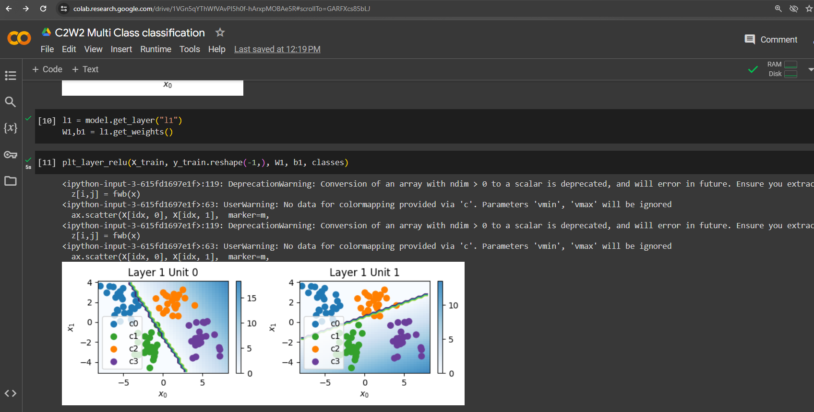

# Demonstração

# INTELIGÊNCIA ARTIFICIAL APLICADA À AUTOMAÇÃO

## Considerações iniciais

A disciplina visa apresentar aos alunos os conceitos de Inteligência
Artificial e como pode ser aplicada em atividades de Automação.  
Serão vistos: conceitos de Inteligência Artificial, Machine Learning,
Redes Neurais, Deep Learning e aplicações com TinyML em automação com
sistemas embarcados.

## Conceitos apresentados na disciplina

- Algoritmos de busca
- Algoritmos de otimização
- Algoritmos genéticos e lógica fuzzy
- Linguagem Python e bibliotecas para uso em IA
- Conceitos de Machine Learning
- - Aprendizado supervisionado
- - Aprendizado não supervisionado
- - Aprendizado por reforço
- ML: classificação, regressão e agrupamento
- ML: Associação e aprendizagem por reforço
- Conceitos de Deep Learning
- Conceitos de Redes Neurais
- Sistemas de Produção com IA
- Visão computacional
- - Reconhecimento de imagens
- - Processamento de linguagem natural
- - Detecção de movimentos
- - Detecção de vibração
- Conceitos sobre TinyML
- - ML para sistemas embarcados

## Atividades de laboratórios e projetos

- Uso do [Orange](https://orangedatamining.com/)
- - Open source machine learning and data visualization
- Uso do [Google Colab](https://colab.research.google.com/)
- - Notebooks Jupyter
- - Exemplos em Python
- Projetos com Edge Impulse [Edge Impulse](https://wwwedgeimpulse.com/)
- [Atividades com
  GitHub](https://docs.github.com/en/get-started/quickstart/hello-world)
- - [Clique aqui para direcionar para o
    vídeo](https://www.youtube.com/watch?v=_hZf1teRFNg)

# Atividades com o Orange

Aprendizado visual dos Algoritmos utilizados em projetos de Machine
Learning 

# Atividades com o Google Colab

O [Google Colab](https://colab.research.google.com/) é utilizado para
atividades básicas com a linguagem Python em aplicações de Machine
Learning 

# Atividades com o Edge Impulse

Desenvolvimento de aplicações de Machine Learning e Deep Learning (Redes
neurais) 

# Atividades com o GitHub

- [Repositório de dados e
  arquivos](https://docs.github.com/en/get-started/quickstart/hello-world)
- [Assista o vídeo](https://www.youtube.com/watch?v=_hZf1teRFNg)
- Crie seu [GitHub](https://github.com/signup?source=login)

# Ecossistema de Inteligência Artificial

# Aplicações de Inteligência Artificial

- Agricultura
- Saúde
- Educação
- Cidades Inteligentes
- Sistemas Autônomos
- Indústrias
- Sistemas financeiros
- Comércio
